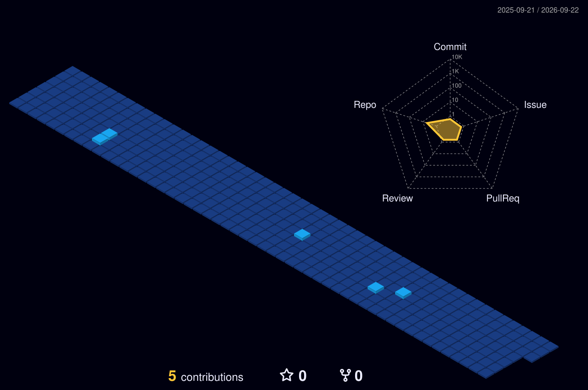

  

<!-- 3D Isometric Contribution Graph (Generated automatically via GitHub Action) -->

  

---

<!-- Dynamic Stats & Language Analytics -->

  
  

<!-- Tech Stack Grid -->

  

<!-- Spline Activity Chart -->

  

  

