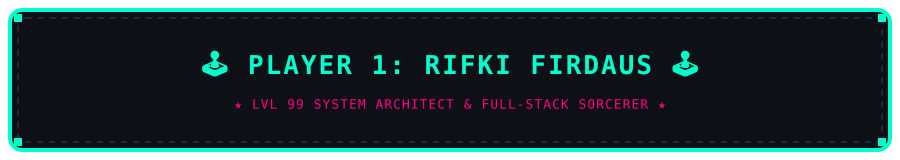

<!-- Retro 8-Bit Pixel Banner -->
<p align="center">
  
</p>

<!-- 8-Bit Quest Slogan -->
<p align="center">
  <a href="https://berakun.web.id">
    
  </a>
</p>

<!-- Animated Pixel Divider -->
<p align="center">
  
</p>

<!-- Pixel Art Centerpiece (Retro Cyber Arcade Workspace) -->
<p align="center">
  
</p>

<!-- Retro Buttons -->
<p align="center">
  <a href="https://berakun.web.id" target="_blank">
    
  </a>
  &nbsp;&nbsp;
  <a href="https://github.com/berakun" target="_blank">
    
  </a>
</p>

<br/>

<!-- Section 1: Character Status Sheet Title (Pixel Font) -->
<p align="center">
  
</p>

<!-- RPG Status Box -->
<table align="center" width="100%">
<tr>
<td style="background-color: #0c1017; border: 2px solid #00FFCC; border-radius: 8px; padding: 18px;">

```yaml
╔═══════════════════════════════════════════════════════════════╗
║  PLAYER       : Rifki Firdaus (@berakun)                      ║
║  CLASS        : Full-Stack Sorcerer & System Architect        ║
║  LEVEL        : 99                                            ║
║  HP (VITALITY): [████████████████████] 9999 / 9999            ║
║  MP (ENERGY)  : [████████████════════] 100% Coffee Overdrive  ║
║  STATUS       : Ready For Co-Op Missions & Engineering Raids  ║
╚═══════════════════════════════════════════════════════════════╝
```

</td>
</tr>
</table>

<br/>

<!-- Section 2: Inventory Title (Pixel Font) -->
<p align="center">
  
</p>

<p align="center">
  
</p>

<!-- Tech Grid -->
<p align="center">
  
</p>

<br/>

<!-- Section 3: Quest Log Title (Pixel Font) -->
<p align="center">
  
</p>

<table align="center" width="100%">
<tr>
<td style="background-color: #0c1017; border: 2px dashed #FF007F; border-radius: 8px; padding: 18px;">

```markdown
► [MAIN WEAPON]   :: Modern Frontend Spells (Vue 3, React, Tailwind CSS, Vite)
► [SHIELD/ARMOR]  :: Resilient Backend APIs (Node.js/Express, Laravel, Python)
► [BASE/FORTRESS] :: Self-Hosted Physical STB Infrastructure (Docker, Nginx, Linux)
► [ULTIMATE CAST] :: Autonomous AI Agents, Multi-Profile Automations & Bot Engines
```

</td>
</tr>
</table>

<br/>

<!-- Retro Arcade Footer -->
<p align="center">
  
</p>

<p align="center">
  
</p>
